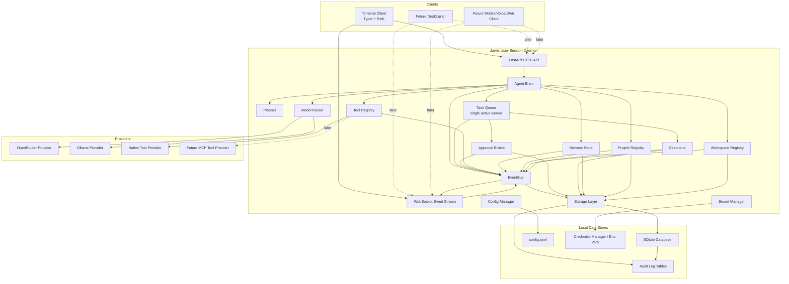

# Jarvis V1 Architecture

Status: Draft for review  
Last updated: 2026-06-10  
Implementation status: No application code should be written until this document is reviewed and approved.

## 1. Purpose

Jarvis is a local-first Windows desktop AI assistant designed to become a persistent background agent. V1 focuses on building the core brain and safety model before investing in richer desktop, mobile, browser, or voice interfaces.

The first usable system should provide:

- A long-running user-session background daemon.
- A terminal-first client.
- Short-term and long-term memory.
- Project and workspace awareness.
- Tool use.
- File access within approved workspaces.
- Command execution with explicit approval.
- OpenRouter as the preferred cloud model provider.
- Ollama as the V1 local model fallback.
- A localhost-only HTTP/WebSocket API for future clients, protected by local API token authentication.

V1 prioritizes reliability, transparency, and controllability over maximum autonomy.

## 2. Core V1 Decisions

| Area | Decision |
| --- | --- |
| Runtime | Python |
| Desktop model | Normal Windows user-session background app, not a Windows Service |
| API | FastAPI over localhost HTTP and WebSocket |
| First client | Typer + Rich terminal command loop |
| Memory database | SQLite |
| Short-term memory | Automatic |
| Long-term memory | Proposed by Jarvis, saved only after user approval |
| Search V1 | Keyword/tag/project/task search |
| Semantic search | Future internal enhancement behind stable memory API |
| Model routing | Provider-agnostic router |
| Primary model provider | OpenRouter |
| Local fallback | Ollama |
| Task execution | One active task at a time with durable queue |
| Planning | Required before non-trivial tasks |
| Tool system | Jarvis-native tools first, provider-based for future MCP support |
| Approvals V1 | Terminal-only UI backed by queued approval requests |
| Approval rules | One-time approvals only in V1 |
| Reusable approval rules | Designed into schema, disabled by default until V2 |
| File access | Explicit approved workspace folders |
| Projects | Logical entities separate from filesystem workspaces |
| Secrets | Windows Credential Manager first, environment variable fallback |
| Config | Human-readable local config file |
| API security | Local API token required for `/v1/*` HTTP endpoints and WebSocket connections |

## 3. High-Level Architecture



## 4. Runtime Model

Jarvis V1 runs as a normal background app inside the logged-in Windows user session.

This is intentionally not a Windows Service in V1 because a user-session app is simpler for:

- Accessing user files.
- Running user-scoped commands.
- Showing terminal approval flows.
- Starting and stopping during development.
- Later adding desktop UI and notifications.

V1 process model:

```text
jarvis daemon
  starts FastAPI server on 127.0.0.1
  initializes core services
  loads config and secrets
  opens SQLite database
  resumes durable task/approval state
  accepts terminal client connections

jarvis terminal
  connects to local daemon
  sends user messages/tasks
  displays streamed events
  displays approval requests
  sends approve/deny responses
```

## 5. Component Responsibilities

### 5.1 Agent Brain

Owns the top-level behavior of Jarvis.

Responsibilities:

- Interpret user messages.
- Select current project context when explicitly set.
- Retrieve relevant short-term and long-term memory.
- Decide whether a request is simple or non-trivial.
- Create plans for non-trivial tasks.
- Submit work to the task queue.
- Request model completions through the model router.
- Request tool execution through the tool registry.
- Emit user-visible events.

The agent brain should not directly:

- Read or write files.
- Execute commands.
- Store secrets.
- Bypass approval checks.
- Depend on a specific model provider.
- Depend on a specific client UI.

### 5.2 Planner

Creates explicit plans for non-trivial work.

Planning is required for:

- Multi-step tasks.
- Project work.
- Code generation.
- File creation or modification.
- Command execution.
- Browser/app automation.
- Any task that is likely to require approvals.

Plan approval and action approval are separate.

Plan approval answers:

```text
Does this approach look right?
```

Action approval answers:

```text
May Jarvis perform this specific risky action?
```

Approving a plan does not automatically approve file writes, commands, installations, automation, or system changes.

### 5.3 Task Queue

V1 supports one active task at a time with a durable task queue.

Responsibilities:

- Create task records.
- Queue tasks.
- Run a single active task worker.
- Pause tasks while waiting for approval.
- Resume tasks after approval.
- Mark tasks completed, failed, cancelled, or paused.
- Persist task status so Jarvis can recover after restart.
- Publish task status events through the EventBus.

The scheduler should be designed so a future worker pool can replace the single worker without changing public APIs.

### 5.4 EventBus

Owns internal event publication and subscription.

Responsibilities:

- Normalize events from the agent, task queue, approvals, tools, models, memory, projects, workspaces, and executors.
- Let WebSocket clients subscribe to live events.
- Keep event payloads JSON-serializable and stable for clients.
- Persist important events through `task_events` and `audit_log` when appropriate.
- Avoid leaking secrets in event payloads.

The EventBus is the bridge between core services and streaming clients. Core components publish events to the EventBus; the WebSocket API streams those events to connected clients.

### 5.5 Approval Broker

Owns risk classification and approval request lifecycle.

Responsibilities:

- Determine whether an action requires approval.
- Create human-readable approval summaries.
- Store immutable action payloads and action hashes for approved actions.
- Store approval requests in a queue.
- Accept approvals/denials from any approval interface.
- Enforce one-time approval semantics in V1.
- Record all decisions in the audit log.

The ApprovalBroker must not depend on terminal UI. Terminal approvals are only the V1 interface over the queued request system.

An approval applies only to the frozen action payload captured in the approval request. Execution must verify the stored action hash before running the action.

### 5.6 Tool Registry

Owns tool discovery, tool metadata, and execution dispatch.

Responsibilities:

- Register Jarvis-native tools.
- Expose tool specs to the agent.
- Route tool calls to providers.
- Declare risk levels and required permissions.
- Send risky tool calls through the ApprovalBroker.
- Normalize tool results.

V1 uses a native tool provider. MCP is a V2 goal and should fit as another provider.

### 5.7 Model Router

Owns model provider selection, fallback, and unified model calls.

Responsibilities:

- Register providers.
- Prefer OpenRouter when available.
- Fall back to Ollama when OpenRouter is unavailable, disabled, rate-limited, or otherwise fails.
- Hide provider-specific request/response details from the agent.
- Support task/model preferences.
- Run lightweight availability checks.
- Avoid logging secrets.

The public agent-facing model API should not change when additional providers are added.

### 5.8 Memory Store

Owns short-term context, memory proposals, long-term memories, and search.

Responsibilities:

- Automatically store short-term context.
- Propose long-term memories.
- Save long-term memory only after approval.
- Search memories by keyword, tag, project, and task in V1.
- Keep a stable public API so semantic search can be added later internally.
- Link memories to projects and tasks.
- Support deletion and future editing.

### 5.9 Workspace Registry

Owns filesystem permission boundaries.

Responsibilities:

- Register approved workspace folders.
- Enable/disable workspace access.
- Resolve workspace aliases.
- Validate whether file actions are inside approved workspaces.
- Require separate approval for access outside registered workspaces.

Workspace access rules:

- Inside approved workspace: read-only actions can run automatically.
- Inside approved workspace: creation, modification, and deletion require approval.
- Outside approved workspace: any access requires separate approval.

### 5.10 Project Registry

Owns logical projects.

Responsibilities:

- Create projects only through explicit user action.
- Switch current project only through explicit user action.
- Persist current project selection through `app_state`.
- Link projects to one or more workspaces.
- Link projects to memories, tasks, notes, and goals.
- Allow workspaces to be reused across projects.

Jarvis may suggest creating a project when it detects recurring work, but must not silently create or switch projects.

### 5.11 Command Executor

Runs approved subprocess commands.

Responsibilities:

- Accept only approved command actions.
- Verify the approval request action hash before execution.
- Validate working directory and workspace relationship.
- Show exact command before execution.
- Show working directory before execution.
- Show environment summary before execution.
- Show timeout before execution.
- Show expected effect and risk level before execution.
- Execute command with timeout.
- Capture stdout, stderr, exit code, start time, and end time.
- Store results in task history and audit log.

V1 should prefer structured subprocess argument lists over shell-specific command strings where possible.

### 5.12 Storage Layer

Owns shared SQLite infrastructure.

Responsibilities:

- Manage SQLite connections.
- Run explicit schema migrations.
- Provide repositories for persisted entities.
- Provide unit-of-work and transaction boundaries.
- Coordinate cross-component writes such as approval decisions, task updates, and audit entries.
- Keep persistence concerns out of the agent brain, tool registry, and client APIs.

All components that persist state should go through the Storage Layer instead of opening SQLite connections independently.

### 5.13 Config Manager

Owns non-secret settings.

Responsibilities:

- Load and validate human-readable config.
- Write user-editable config.
- Provide defaults.
- Never store secrets.

Suggested location:

```text
%APPDATA%\Jarvis\config.toml
```

### 5.14 Secret Manager

Owns credentials and secrets.

Responsibilities:

- Retrieve OpenRouter API key.
- Retrieve the local Jarvis API token.
- Prefer Windows Credential Manager.
- Fall back to environment variables.
- Never expose secret values in logs, memory, prompts, events, or API responses.

## 6. Module and Package Layout

V1 should use a single Python package with clear submodules.

```text
jarvis/
  __init__.py

  app/
    __init__.py
    daemon.py
    terminal.py

  api/
    __init__.py
    http.py
    websocket.py
    schemas.py

  approvals/
    __init__.py
    broker.py
    queue.py
    policies.py
    models.py

  config/
    __init__.py
    manager.py
    secrets.py
    models.py

  core/
    __init__.py
    agent.py
    event_bus.py
    planner.py
    task_queue.py
    events.py
    models.py

  execution/
    __init__.py
    commands.py
    models.py

  memory/
    __init__.py
    store.py
    repository.py
    models.py

  models/
    __init__.py
    router.py
    providers.py
    openrouter.py
    ollama.py
    schemas.py

  projects/
    __init__.py
    registry.py
    models.py

  storage/
    __init__.py
    connection.py
    migrations.py
    repositories.py
    unit_of_work.py

  tools/
    __init__.py
    registry.py
    specs.py
    results.py
    native/
      __init__.py
      files.py
      memory.py
      projects.py
      commands.py

  workspaces/
    __init__.py
    registry.py
    policies.py
    models.py
```

Future extraction should be possible into:

```text
jarvis-core
jarvis-daemon
jarvis-cli
jarvis-desktop
```

## 7. Data Model and SQLite Schema

SQLite is the V1 persistence layer. The shared Storage Layer owns SQLite connections, migrations, repositories, and unit-of-work transaction boundaries. Schema migrations should be explicit and versioned.

### 7.1 Schema Versioning

```sql
CREATE TABLE schema_migrations (
    version INTEGER PRIMARY KEY,
    name TEXT NOT NULL,
    applied_at TEXT NOT NULL
);
```

### 7.2 App State

```sql
CREATE TABLE app_state (
    key TEXT PRIMARY KEY,
    value_json TEXT NOT NULL,
    updated_at TEXT NOT NULL
);
```

`app_state` stores restart-visible daemon state such as:

```text
current_project_id
daemon_instance_id
last_started_at
```

The current project is changed only by explicit user action, but the selected project persists through daemon restart.

### 7.3 Workspaces

```sql
CREATE TABLE workspaces (
    id TEXT PRIMARY KEY,
    name TEXT NOT NULL,
    path TEXT NOT NULL UNIQUE,
    enabled INTEGER NOT NULL DEFAULT 1,
    read_policy TEXT NOT NULL DEFAULT 'auto_inside_workspace',
    write_policy TEXT NOT NULL DEFAULT 'approval_required',
    created_at TEXT NOT NULL,
    updated_at TEXT NOT NULL
);
```

### 7.4 Projects

```sql
CREATE TABLE projects (
    id TEXT PRIMARY KEY,
    name TEXT NOT NULL UNIQUE,
    description TEXT,
    status TEXT NOT NULL DEFAULT 'active',
    created_at TEXT NOT NULL,
    updated_at TEXT NOT NULL
);

CREATE TABLE project_workspaces (
    project_id TEXT NOT NULL,
    workspace_id TEXT NOT NULL,
    created_at TEXT NOT NULL,
    PRIMARY KEY (project_id, workspace_id),
    FOREIGN KEY (project_id) REFERENCES projects(id),
    FOREIGN KEY (workspace_id) REFERENCES workspaces(id)
);

CREATE TABLE project_notes (
    id TEXT PRIMARY KEY,
    project_id TEXT NOT NULL,
    title TEXT,
    body TEXT NOT NULL,
    created_at TEXT NOT NULL,
    updated_at TEXT NOT NULL,
    FOREIGN KEY (project_id) REFERENCES projects(id)
);

CREATE TABLE project_goals (
    id TEXT PRIMARY KEY,
    project_id TEXT NOT NULL,
    title TEXT NOT NULL,
    description TEXT,
    status TEXT NOT NULL DEFAULT 'active',
    created_at TEXT NOT NULL,
    updated_at TEXT NOT NULL,
    FOREIGN KEY (project_id) REFERENCES projects(id)
);
```

### 7.5 Tasks

```sql
CREATE TABLE tasks (
    id TEXT PRIMARY KEY,
    project_id TEXT,
    title TEXT NOT NULL,
    user_request TEXT NOT NULL,
    status TEXT NOT NULL,
    priority INTEGER NOT NULL DEFAULT 100,
    current_step_id TEXT,
    created_at TEXT NOT NULL,
    updated_at TEXT NOT NULL,
    started_at TEXT,
    completed_at TEXT,
    FOREIGN KEY (project_id) REFERENCES projects(id)
);

CREATE TABLE task_steps (
    id TEXT PRIMARY KEY,
    task_id TEXT NOT NULL,
    step_index INTEGER NOT NULL,
    title TEXT NOT NULL,
    description TEXT,
    status TEXT NOT NULL DEFAULT 'pending',
    requires_approval INTEGER NOT NULL DEFAULT 0,
    created_at TEXT NOT NULL,
    updated_at TEXT NOT NULL,
    FOREIGN KEY (task_id) REFERENCES tasks(id)
);

CREATE TABLE task_events (
    id TEXT PRIMARY KEY,
    task_id TEXT NOT NULL,
    step_id TEXT,
    event_type TEXT NOT NULL,
    message TEXT,
    payload_json TEXT,
    created_at TEXT NOT NULL,
    FOREIGN KEY (task_id) REFERENCES tasks(id),
    FOREIGN KEY (step_id) REFERENCES task_steps(id)
);
```

Task statuses:

```text
queued
planning
waiting_for_plan_approval
running
waiting_for_approval
paused
completed
cancelled
failed
```

Step statuses:

```text
pending
running
waiting_for_approval
completed
skipped
failed
```

### 7.6 Memory

```sql
CREATE TABLE short_term_context (
    id TEXT PRIMARY KEY,
    project_id TEXT,
    task_id TEXT,
    source TEXT NOT NULL,
    role TEXT,
    content TEXT NOT NULL,
    tags_json TEXT,
    importance INTEGER NOT NULL DEFAULT 0,
    expires_at TEXT,
    created_at TEXT NOT NULL,
    FOREIGN KEY (project_id) REFERENCES projects(id),
    FOREIGN KEY (task_id) REFERENCES tasks(id)
);

CREATE TABLE long_term_memory (
    id TEXT PRIMARY KEY,
    project_id TEXT,
    task_id TEXT,
    title TEXT,
    content TEXT NOT NULL,
    tags_json TEXT,
    source TEXT NOT NULL,
    created_at TEXT NOT NULL,
    updated_at TEXT NOT NULL,
    archived_at TEXT,
    FOREIGN KEY (project_id) REFERENCES projects(id),
    FOREIGN KEY (task_id) REFERENCES tasks(id)
);

CREATE TABLE memory_proposals (
    id TEXT PRIMARY KEY,
    project_id TEXT,
    task_id TEXT,
    proposed_content TEXT NOT NULL,
    proposed_tags_json TEXT,
    reason TEXT NOT NULL,
    status TEXT NOT NULL DEFAULT 'pending',
    created_at TEXT NOT NULL,
    decided_at TEXT,
    FOREIGN KEY (project_id) REFERENCES projects(id),
    FOREIGN KEY (task_id) REFERENCES tasks(id)
);
```

Memory proposal statuses:

```text
pending
approved
denied
expired
```

The V1 memory public interface should look like:

```python
class MemoryStore:
    def add_short_term(...)
    def propose_long_term(...)
    def approve_long_term(...)
    def deny_long_term(...)
    def search(...)
    def link_to_project(...)
    def link_to_task(...)
```

The implementation of `search(...)` can later add embeddings internally without changing callers.

### 7.7 Approvals

```sql
CREATE TABLE approval_requests (
    id TEXT PRIMARY KEY,
    task_id TEXT,
    step_id TEXT,
    action_type TEXT NOT NULL,
    risk_level TEXT NOT NULL,
    summary TEXT NOT NULL,
    action_json TEXT NOT NULL,
    action_hash TEXT NOT NULL,
    details_json TEXT NOT NULL,
    status TEXT NOT NULL DEFAULT 'pending',
    created_at TEXT NOT NULL,
    decided_at TEXT,
    decided_by TEXT,
    decision_reason TEXT,
    expires_at TEXT,
    FOREIGN KEY (task_id) REFERENCES tasks(id),
    FOREIGN KEY (step_id) REFERENCES task_steps(id)
);

CREATE TABLE approval_rules (
    id TEXT PRIMARY KEY,
    name TEXT NOT NULL,
    action_type TEXT NOT NULL,
    pattern_json TEXT NOT NULL,
    workspace_id TEXT,
    enabled INTEGER NOT NULL DEFAULT 0,
    created_at TEXT NOT NULL,
    updated_at TEXT NOT NULL,
    FOREIGN KEY (workspace_id) REFERENCES workspaces(id)
);
```

Approval statuses:

```text
pending
approved
denied
expired
cancelled
```

`approval_rules` exists for future compatibility but is disabled in V1.

An approval applies only to the immutable `action_json` captured in the request. Executors must recompute and verify `action_hash` before running the approved action.

### 7.8 Tool Runs and Commands

```sql
CREATE TABLE tool_runs (
    id TEXT PRIMARY KEY,
    task_id TEXT,
    step_id TEXT,
    approval_request_id TEXT,
    tool_name TEXT NOT NULL,
    input_json TEXT NOT NULL,
    status TEXT NOT NULL,
    output_json TEXT,
    error TEXT,
    started_at TEXT NOT NULL,
    completed_at TEXT,
    FOREIGN KEY (task_id) REFERENCES tasks(id),
    FOREIGN KEY (step_id) REFERENCES task_steps(id),
    FOREIGN KEY (approval_request_id) REFERENCES approval_requests(id)
);

CREATE TABLE command_runs (
    id TEXT PRIMARY KEY,
    task_id TEXT,
    step_id TEXT,
    approval_request_id TEXT NOT NULL,
    command_json TEXT NOT NULL,
    command_display TEXT NOT NULL,
    working_directory TEXT NOT NULL,
    environment_summary_json TEXT NOT NULL,
    timeout_seconds INTEGER NOT NULL,
    exit_code INTEGER,
    stdout TEXT,
    stderr TEXT,
    started_at TEXT NOT NULL,
    completed_at TEXT,
    FOREIGN KEY (task_id) REFERENCES tasks(id),
    FOREIGN KEY (step_id) REFERENCES task_steps(id),
    FOREIGN KEY (approval_request_id) REFERENCES approval_requests(id)
);
```

### 7.9 Audit Log

```sql
CREATE TABLE audit_log (
    id TEXT PRIMARY KEY,
    actor TEXT NOT NULL,
    action_type TEXT NOT NULL,
    target TEXT,
    summary TEXT NOT NULL,
    details_json TEXT,
    task_id TEXT,
    approval_request_id TEXT,
    created_at TEXT NOT NULL,
    FOREIGN KEY (task_id) REFERENCES tasks(id),
    FOREIGN KEY (approval_request_id) REFERENCES approval_requests(id)
);
```

Audit entries should be created for:

- Approval request creation.
- Approval or denial.
- Command execution.
- File creation, modification, deletion.
- Workspace registration/removal.
- Project creation/switching.
- Long-term memory approval/denial.
- Secret/config lifecycle events, without secret values.

## 8. Public Core Interfaces

These are conceptual service interfaces. Exact method signatures may evolve during implementation, but these boundaries should remain stable.

### 8.1 Model Router

```python
class ModelRouter:
    async def complete(self, request: ModelRequest) -> ModelResponse: ...
    async def stream(self, request: ModelRequest) -> AsyncIterator[ModelEvent]: ...
    async def check_availability(self) -> list[ProviderStatus]: ...
```

### 8.2 Tool Registry

```python
class ToolRegistry:
    def register_provider(self, provider: ToolProvider) -> None: ...
    def list_tools(self) -> list[ToolSpec]: ...
    async def execute(self, call: ToolCall, context: ToolContext) -> ToolResult: ...
```

### 8.3 Approval Broker

```python
class ApprovalBroker:
    async def requires_approval(self, action: ProposedAction) -> ApprovalDecision: ...
    async def create_request(self, action: ProposedAction) -> ApprovalRequest: ...
    async def approve(self, request_id: str, decided_by: str) -> ApprovalResult: ...
    async def deny(self, request_id: str, decided_by: str, reason: str | None) -> ApprovalResult: ...
    async def list_pending(self) -> list[ApprovalRequest]: ...
```

### 8.4 Task Queue

```python
class TaskQueue:
    async def submit(self, request: TaskRequest) -> Task: ...
    async def get(self, task_id: str) -> Task: ...
    async def list(self, status: str | None = None) -> list[Task]: ...
    async def cancel(self, task_id: str) -> Task: ...
    async def run_next(self) -> None: ...
```

### 8.5 Workspace Registry

```python
class WorkspaceRegistry:
    async def add(self, name: str, path: str) -> Workspace: ...
    async def remove(self, workspace_id: str) -> None: ...
    async def list(self) -> list[Workspace]: ...
    async def resolve_for_path(self, path: str) -> Workspace | None: ...
    async def check_access(self, path: str, operation: str) -> AccessDecision: ...
```

### 8.6 Project Registry

```python
class ProjectRegistry:
    async def create(self, name: str, description: str | None = None) -> Project: ...
    async def switch_current(self, project_id: str | None) -> None: ...
    async def get_current(self) -> Project | None: ...
    async def link_workspace(self, project_id: str, workspace_id: str) -> None: ...
```

## 9. API Design

The API should be a thin adapter over core services. Clients should not reach into implementation modules.

All V1 endpoints bind to:

```text
http://127.0.0.1:<configured-port>
ws://127.0.0.1:<configured-port>
```

Authentication:

```text
GET /health -> unauthenticated
/v1/* HTTP endpoints -> local API token required
/v1/events WebSocket -> local API token required
```

The local API token is a secret managed by the SecretManager. It must not be stored in `config.toml`.

Suggested default port:

```text
8765
```

### 9.1 Health and Status

```text
GET /health
GET /v1/status
GET /v1/config/public
```

Purpose:

- Confirm daemon is running.
- Show active provider status.
- Show current project.
- Show queue state.
- Expose non-secret public config.

### 9.2 Messages and Tasks

```text
POST /v1/messages
POST /v1/tasks
GET  /v1/tasks
GET  /v1/tasks/{task_id}
POST /v1/tasks/{task_id}/cancel
```

`POST /v1/messages` is for conversational turns.

`POST /v1/tasks` is for explicit task creation.

Both may create durable task records when work is non-trivial.

### 9.3 Plans

```text
GET  /v1/tasks/{task_id}/plan
POST /v1/tasks/{task_id}/plan/approve
POST /v1/tasks/{task_id}/plan/reject
```

Plan approval allows the task to proceed to step execution, but does not approve individual risky actions.

### 9.4 Approvals

```text
GET  /v1/approvals
GET  /v1/approvals/{approval_id}
POST /v1/approvals/{approval_id}/approve
POST /v1/approvals/{approval_id}/deny
```

Approvals are queued and interface-agnostic. Terminal is only the first client.

### 9.5 Memory

```text
GET  /v1/memory/search
GET  /v1/memory/proposals
POST /v1/memory/proposals/{proposal_id}/approve
POST /v1/memory/proposals/{proposal_id}/deny
GET  /v1/memory/long-term
DELETE /v1/memory/long-term/{memory_id}
```

Long-term memory creation must go through proposal approval.

### 9.6 Projects

```text
GET  /v1/projects
POST /v1/projects
GET  /v1/projects/current
POST /v1/projects/current
POST /v1/projects/{project_id}/workspaces/{workspace_id}
DELETE /v1/projects/{project_id}/workspaces/{workspace_id}
```

Project creation and switching are explicit user actions.

### 9.7 Workspaces

```text
GET  /v1/workspaces
POST /v1/workspaces
DELETE /v1/workspaces/{workspace_id}
POST /v1/workspaces/{workspace_id}/disable
POST /v1/workspaces/{workspace_id}/enable
```

Adding or removing workspaces should be audited.

### 9.8 Tools

```text
GET /v1/tools
GET /v1/tools/{tool_name}
```

Direct tool execution from clients should be avoided in V1 unless it goes through the same task and approval flow.

### 9.9 WebSocket Events

```text
GET /v1/events
```

Event types:

```text
agent.message.delta
agent.message.completed
task.created
task.updated
task.completed
task.failed
task.cancelled
plan.created
plan.approved
plan.rejected
approval.created
approval.approved
approval.denied
tool.started
tool.completed
tool.failed
command.started
command.completed
memory.proposal.created
memory.proposal.approved
memory.proposal.denied
project.current_changed
workspace.updated
```

## 10. Approval Policy

### 10.1 Automatic in V1

Read-only actions can run automatically when they are within approved boundaries:

- Read files inside approved workspaces.
- List directories inside approved workspaces.
- Search files inside approved workspaces.
- Search local memory.
- Inspect project/task state.
- Query model providers.
- List registered tools.

### 10.2 Requires Approval in V1

Approval is required for:

- File creation.
- File modification.
- File deletion.
- Command execution.
- Package installation.
- Browser automation.
- App automation.
- System setting changes.
- Access outside registered workspaces.
- Long-term memory saves.
- Workspace registration/removal.
- Any action classified as potentially destructive or privacy-sensitive.

### 10.3 Approval Request Content

Each approval request must show:

- Exact action.
- Frozen action payload.
- Action hash.
- Scope.
- Target path, command, URL, or resource.
- Working directory when relevant.
- Environment summary when relevant.
- Timeout when relevant.
- Expected effect.
- Risk level.
- Why Jarvis wants to do it.
- Associated task and step.

For command execution, show:

```text
Command:
  exact command display

Working directory:
  path

Environment:
  inherited user environment plus Jarvis task metadata
  secrets redacted

Timeout:
  N seconds

Expected effect:
  explanation

Risk:
  risk labels
```

### 10.4 One-Time Approval Semantics

V1 approvals are one-time only.

Approval applies only to:

- The exact action.
- The immutable `action_json` payload.
- The stored `action_hash`.
- The exact request id.
- The exact task/step context.

Before execution, the executor must recompute the action hash and verify it matches the approved request.

V1 must not silently create reusable allow rules.

## 11. Memory Design

### 11.1 Short-Term Memory

Short-term memory is automatic and local.

Examples:

- Recent conversation turns.
- Active task context.
- Current project context.
- Temporary notes produced during task execution.
- Tool results relevant to the current task.

Short-term memory may expire or be pruned automatically.

### 11.2 Long-Term Memory

Long-term memory is durable and user-approved.

Flow:

```text
Jarvis notices something possibly important
  -> creates memory proposal
  -> asks: "This seems important. Save it?"
  -> user approves or denies
  -> approved proposal becomes long-term memory
  -> decision is audited
```

Long-term memories should be:

- Searchable.
- Taggable.
- Linkable to projects.
- Linkable to tasks.
- Editable/deletable in future UI.
- Audited when created or removed.

### 11.3 Search

V1 search:

- Keyword search.
- Tag filters.
- Project filters.
- Task filters.

Future semantic search should be added behind the existing MemoryStore API.

Possible future table:

```sql
CREATE TABLE memory_embeddings (
    memory_id TEXT PRIMARY KEY,
    provider TEXT NOT NULL,
    model TEXT NOT NULL,
    embedding BLOB NOT NULL,
    created_at TEXT NOT NULL,
    FOREIGN KEY (memory_id) REFERENCES long_term_memory(id)
);
```

This table is not required in V1.

## 12. Model Routing

### 12.1 Provider Order

Default V1 provider chain:

```text
OpenRouter
  -> Ollama
```

Fallback triggers:

- OpenRouter disabled.
- Missing OpenRouter API key.
- Network failure.
- Provider timeout.
- Rate limit.
- Provider error considered retryable.

### 12.2 Provider-Agnostic API

The agent asks for a model completion through the router. It does not directly call OpenRouter or Ollama.

Provider result should normalize:

- Message content.
- Streaming deltas.
- Tool-call requests if supported.
- Token usage if available.
- Provider name.
- Model name.
- Error category.

### 12.3 Suggested Config

```toml
[models]
primary_provider = "openrouter"
fallback_provider = "ollama"
default_model = "openai/gpt-4.1"
local_model = "llama3.1"
request_timeout_seconds = 120
```

Exact model names may change during implementation.

## 13. Native Tool System

### 13.1 ToolSpec

Each tool declares metadata used by the agent and approval system.

```python
ToolSpec(
    name="file.write",
    description="Create or modify a file in an approved workspace.",
    input_schema={...},
    risk_level="requires_approval",
    permissions=["file.write"],
)
```

### 13.2 V1 Native Tools

Initial native tools:

- `memory.search`
- `memory.propose_long_term`
- `project.list`
- `project.current`
- `workspace.list`
- `file.read`
- `file.list`
- `file.search`
- `file.write`
- `file.patch`
- `file.delete`
- `command.prepare`
- `command.execute`

Read-only file tools:

```text
file.read
file.list
file.search
```

Approval-required file tools:

```text
file.write
file.patch
file.delete
```

Potential early additions:

- `task.list`
- `task.status`
- `audit.search`

### 13.3 Risk Levels

Suggested risk levels:

```text
read_only
approval_required
destructive
system_change
secret_sensitive
```

V1 policy can map all non-read-only levels to approval required.

## 14. File Access Model

V1 only grants automatic read access inside registered workspaces.

Rules:

```text
Inside approved workspace:
  file.read/file.list/file.search -> automatic
  file.write/file.patch/file.delete -> approval required

Outside approved workspace:
  read/list/search/create/modify/delete -> approval required
```

Paths must be normalized before policy checks.

The workspace registry should defend against:

- Relative path escapes.
- Symlink/junction surprises where practical.
- Case-insensitive path mismatches on Windows.
- Ambiguous aliases.

## 15. Project Model

Projects are logical containers, not filesystem permission boundaries.

A project can contain:

- Goals.
- Notes.
- Tasks.
- Memories.
- Linked workspaces.

Relationship rules:

- One project can link to many workspaces.
- One workspace can be linked to many projects.
- Jarvis can suggest a project.
- User must explicitly create a project.
- User must explicitly switch current project.
- Current project selection persists through `app_state`.
- Jarvis must show current project in terminal context when set.

Suggested terminal prompt:

```text
Jarvis [project: jarvis-core]>
```

## 16. Task Lifecycle

### 16.1 Simple Requests

Simple read-only or conversational request:

```text
user message
  -> agent responds directly
  -> short-term context stored
```

### 16.2 Non-Trivial Tasks

Non-trivial task:

```text
user request
  -> task created
  -> task status: planning
  -> plan created
  -> task status: waiting_for_plan_approval
  -> user approves plan
  -> task status: queued
  -> scheduler starts task
  -> task status: running
  -> step executes
  -> risky action proposed
  -> approval request created
  -> task status: waiting_for_approval
  -> user approves or denies
  -> task resumes or adjusts
  -> task completes/fails/cancels
```

### 16.3 Restart Recovery

On daemon startup:

- Load queued tasks.
- Detect tasks left in running state.
- Mark interrupted tasks as paused or failed with reason.
- Keep pending approval requests pending.
- Publish current state to connected clients.

## 17. Security Model

V1 is local-only and conservative.

### 17.1 Network Boundary

- Bind API to `127.0.0.1` only.
- Do not listen on LAN interfaces.
- Do not expose remote control.
- Require a local API token for all `/v1/*` HTTP endpoints.
- Require a local API token for WebSocket connections.
- Keep `GET /health` unauthenticated for basic process checks.

### 17.2 Secrets

- Config files must not store secrets.
- Logs must not include secrets.
- Model prompts should not include secret values.
- API responses must not include secret values.
- Secret retrieval should prefer Windows Credential Manager.
- Environment variable fallback is allowed.

Suggested environment variable:

```text
JARVIS_API_TOKEN
OPENROUTER_API_KEY
```

### 17.3 Filesystem

- Workspace registration is explicit.
- Reads are automatic only inside approved workspaces.
- Writes always require approval.
- Outside-workspace access requires approval.
- File actions are audited.

### 17.4 Commands

- Commands require approval every time in V1.
- Approval request shows exact command and context.
- Execution captures output.
- Execution has a timeout.
- Results are attached to task history and audit log.

### 17.5 Auditability

Any meaningful action should leave a durable trail:

- Who or what initiated it.
- What was requested.
- What was approved or denied.
- What ran.
- What changed.
- What output was produced.
- When it happened.

## 18. Configuration

Suggested non-secret config:

```toml
[server]
host = "127.0.0.1"
port = 8765

[models]
primary_provider = "openrouter"
fallback_provider = "ollama"
default_model = "openai/gpt-4.1"
local_model = "llama3.1"
request_timeout_seconds = 120

[memory]
database_path = "%APPDATA%/Jarvis/memory.sqlite"
short_term_retention_days = 30

[approvals]
mode = "terminal_queue"
reusable_rules_enabled = false

[tasks]
max_active_tasks = 1
default_command_timeout_seconds = 120

[security]
localhost_only = true
api_token_enabled = true
```

Secrets are stored separately:

```text
Windows Credential Manager:
  service: Jarvis
  account: API Token

Windows Credential Manager:
  service: Jarvis
  account: OpenRouter

Environment fallback:
  JARVIS_API_TOKEN
  OPENROUTER_API_KEY
```

## 19. Terminal Client V1

V1 terminal client uses Typer + Rich.

Responsibilities:

- Start interactive command loop.
- Connect to local daemon.
- Send messages and task requests.
- Stream agent output.
- Show current project.
- Show pending approvals.
- Approve or deny queued approval requests.
- Run basic project, workspace, memory, and task commands.

The terminal client must not contain core business logic.

Future TUI views can reuse the same API:

- Task status.
- Approval queue.
- Project view.
- Memory browser.
- Activity logs.

## 20. Future Extensions

### 20.1 V2 Candidates

- MCP tool provider.
- Desktop approval notifications.
- Reusable approval rules.
- Richer TUI.
- Browser automation tools.
- App automation tools.
- Semantic memory search.
- Background watchers for approved workspaces.
- Scheduled tasks and reminders.
- More model providers.
- Import/export memory.

### 20.2 V3 Candidates

- Desktop UI.
- Voice interface.
- Mobile approval client.
- Remote access with strong authentication.
- Multi-agent task decomposition.
- Concurrent task execution.
- Plugin marketplace or plugin folder.
- Advanced project knowledge graph.
- Windows Service mode for selected background capabilities.
- Cross-device sync with encryption.

## 21. Phased Implementation Plan

### Phase 0: Project Foundation

Goal: Create the basic Python project skeleton and development tooling.

Deliverables:

- Python package layout.
- Dependency management.
- Formatting/linting/test setup.
- Basic config loading.
- Basic Storage Layer with SQLite connection and migrations.
- EventBus foundation.

Exit criteria:

- Project imports cleanly.
- Tests can run.
- Empty daemon can start and stop.
- Storage migrations can run against an empty database.
- EventBus can publish and subscribe in process.

### Phase 1: Daemon/API Shell and Terminal Connection

Goal: Establish localhost FastAPI daemon and terminal client connection.

Deliverables:

- FastAPI app.
- Health/status endpoints.
- WebSocket event stream.
- Typer + Rich terminal command loop.
- Localhost-only binding.
- Local API token enforcement for `/v1/*` and WebSocket routes.

Exit criteria:

- Terminal can connect to daemon.
- Terminal can receive server events.
- Health endpoint reports daemon status.
- Authenticated status requests succeed.
- Unauthenticated `/v1/*` requests fail clearly.

### Phase 2: Storage, App State, Projects, Workspaces, and Audit Baseline

Goal: Add durable local state and explicit context boundaries.

Deliverables:

- SQLite migrations.
- Shared repositories and unit-of-work boundaries.
- `app_state` persistence.
- Workspace registry.
- Project registry.
- Current project selection.
- Project-workspace linking.
- Audit log baseline.

Exit criteria:

- User can register a workspace.
- User can create and switch projects.
- Current project survives daemon restart.
- State survives daemon restart.

### Phase 3: Model Router and Provider Status

Goal: Add provider-agnostic model access.

Deliverables:

- ModelRouter interface.
- OpenRouter provider.
- Ollama provider.
- Availability checks.
- Fallback chain.
- Secret manager integration.

Exit criteria:

- Jarvis can complete through OpenRouter.
- Jarvis falls back to Ollama when needed.
- Agent code is provider-agnostic.

### Phase 4: Memory Storage, Search, and Proposals

Goal: Add short-term context and approved long-term memory.

Deliverables:

- Short-term memory storage.
- Keyword/tag/project/task search.
- Memory proposals.
- Approval/denial flow for long-term memory.

Exit criteria:

- Jarvis stores short-term context automatically.
- Approved memories are searchable.
- Jarvis can ask "This seems important. Save it?"

### Phase 5: Task Queue and Planning

Goal: Add durable tasks and explicit plans.

Deliverables:

- Task queue.
- Single active worker.
- Task lifecycle persistence.
- Plan creation.
- Plan approval/rejection endpoints.
- EventBus-backed task events.

Exit criteria:

- Non-trivial requests create plans.
- User can approve/reject plan.
- Approved tasks execute one step at a time.

### Phase 6: Approval Broker

Goal: Add queued approval requests independent of terminal UI.

Deliverables:

- ApprovalBroker.
- Approval request schema.
- Immutable `action_json` and `action_hash`.
- Approval queue endpoints.
- Terminal approval display.
- Audit logging.
- One-time approval enforcement.

Exit criteria:

- Risky actions create queued approval requests.
- Terminal can approve/deny.
- Executors can verify approved action hashes.
- Decisions are audited.

### Phase 7: Native Tools and File Access

Goal: Add native tools and approved workspace file access.

Deliverables:

- ToolRegistry.
- ToolSpec model.
- Native file read/list/search tools.
- Native file write/patch/delete tools.
- Native memory/project/workspace tools.
- Workspace access policy checks.

Exit criteria:

- Agent can use read-only tools inside approved workspaces.
- File write/patch/delete tools require approval.
- Out-of-workspace access requires approval.
- Tool runs are logged.

### Phase 8: Command Execution

Goal: Add approved subprocess execution.

Deliverables:

- CommandExecutor.
- Command approval previews.
- Approval action hash verification.
- Timeout support.
- Captured stdout/stderr/exit code.
- Command run persistence.

Exit criteria:

- Jarvis can propose a command.
- User sees exact command and context.
- Approved command runs.
- Output attaches to task history and audit log.

### Phase 9: Review Hardening

Goal: Make V1 dependable enough for daily local use.

Deliverables:

- Error handling.
- Restart recovery.
- Cancellation paths.
- Basic docs.
- Test coverage for policies, approvals, memory, task lifecycle, and routing.

Exit criteria:

- No known bypass around approval policy.
- Daemon restart does not lose queued tasks or pending approvals.
- Core workflows are covered by tests.

## 22. Architecture Diff

Changes incorporated from architecture review:

- Added shared `jarvis/storage` layer for SQLite connections, migrations, repositories, and transaction boundaries.
- Added internal `EventBus` for task, approval, tool, memory, project, workspace, and WebSocket events.
- Changed V1 API security from optional token to required local API token for `/v1/*` and WebSocket routes.
- Added `app_state` persistence for current project and daemon-visible state.
- Added immutable `action_json` and `action_hash` to approval requests.
- Added approval-required `file.write`, `file.patch`, and `file.delete` native tools.
- Reordered phases so model routing precedes model-dependent memory proposals and planning-heavy task behavior.

## 23. Open Questions for Review

These can be decided before implementation or during Phase 0:

- Which OpenRouter default model should V1 use?
- Which Ollama local model should V1 assume by default?
- Should the SQLite database live under `%APPDATA%\Jarvis` immediately, or inside the development repo until packaging?
- Should workspace registration itself require a confirmation prompt in the terminal, or is the explicit command enough?
- Should task plan approval be required for all file writes/commands, or only for multi-step tasks?

## 24. Review Checklist

Before code is written, confirm:

- V1 scope is acceptable.
- Approval policy is conservative enough.
- Project/workspace separation matches the intended mental model.
- Memory proposal flow matches desired behavior.
- API surface is enough for terminal V1 and future clients.
- Database schema captures required auditability.
- Implementation phases are in the right order.
